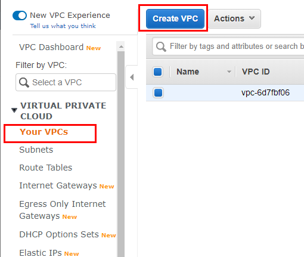
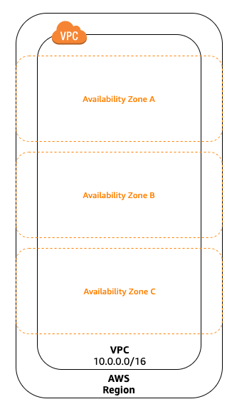
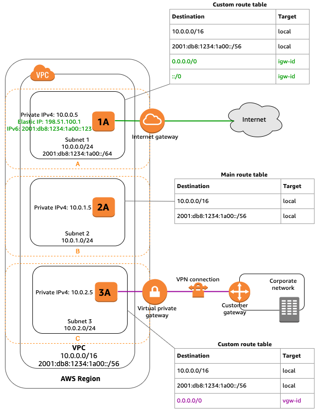

<p align="center">
  <a href="" rel="noopener">
 </a>
 <br>

 
</p>

<h3 align="center">AWS VPC Tutorial</h3>

<div align="center">

[]()
[](https://github.com/da-huin/aws-vpc-tutorial/issues)
[](https://github.com/da-huin/aws-vpc-tutorial/pulls)
[](/LICENSE)

</div>

---

<p align="center"> 
    <br> In this document, we create a VPC, create an EC2 instance, and connect it externally.

</p>

### Tutorial

1. **Preview**
    1. Create VPC
    2. Create Subnet
    3. Create Internet Gateway and connect to VPC
    4. Create Security Group for Internet Access
    5. Add Elastic IP
2. **Create VPC**
    1. Open URL below.

        [https://console.aws.amazon.com/vpc/](https://console.aws.amazon.com/vpc/)

    2. Click Create VPC button.

        

    3. Fill the forms.

        

        - How to fill the `IPv4 CIDR block`?
            - Calculate at [https://www.ipaddressguide.com/cidr](https://www.ipaddressguide.com/cidr)
            - [https://docs.aws.amazon.com/vpc/latest/userguide/VPC_Subnets.html#vpc-resize](https://docs.aws.amazon.com/vpc/latest/userguide/VPC_Subnets.html#vpc-resize)
            - Block sizes must be between /16 netmask ~ /28 netmask.
3. **Create Subnet**
    1. Click `Create Subnet` button.

        

        

4. **Create Internet Gateway**

    

    

5. **Create Routing Table**

    

6. **Connect Internet Gateway.**

    It receives all traffic from the gateway.

    

7. **Connect Subnet**

    It sends 173.32.0.0/20 traffics to subnet-03fec5aa1d555ac...

    

8. **Create EC2 Instance**
    1. Configure Instance

        

    2. Review And Launch Instance.

        

9. **Check your instance**

    Public IP is empty because we disabled Auto-assign Public IP.

    

10. **Check `Network Interface`**

    If you create EC2 Instance, Network Interface that connected the Instance is created automatically.

    

11. **Add Elastic IP**

    

12. Associate the Elastic IP

    

    

13. **Connect your instance wtih SSH and the Elastic IP address.**
14. **Enter the command below.**

    ```python
    python3 -m http.server 80
    ```

15. **Open http://YOUR_ELASTIC_IP_ADDRESS**

    

16. **Success!**

### Reference

**What is Amazon VPC?**

- Virtual Private Cloud

**Conecpt of Amazon VPC**

- `VPC` is User's Virtual Private Network.
- `Subnet` is VPC's IP Address range.
- `Routing Table` is set of rules, there are used to determine where network traffic is directed.
- `VPC Endpoint` is VPC's endpoint.

**VPCs and subnets**

- Use a public subnet resources that must be connected to the internet, and a private subnet for resources that won't be connected to the internet.
- To protect the AWS resources, you can use multiple layers of security, including `security groups` and `network access control lists (ACL)`
    - One of the things you create EC2 Instance is a `security group`.
    - `ACL` connected with VPC. `ACL` is VPC's security group. it can be set up `inbound rules` and `outbound rules`.

**Routing Table**

- Each route in a route table specifies the range of IP addresses where you want the traffic to go (the destination) and the gateway, network interface, or connection through which to send the traffic (the target).
- The routing table determines where the network traffic of a subnet or gateway is transmitted.

    

**Internet Access**

- **default VPC**


- **Private VPC**

    

    - you can connect with `elastic ip` to user instance.

        `Internet gateway` also required.

        

**NAT**

- Network Address Translation

**Accessing a corporate or home netweork.**

- You can optionally connect your VPC to your own corporate data center using an IPsec AWS Site-to-Site VPN connection, making the AWS Cloud an extension of your data center.

    

**Accessing services through AWS PrivateLink**


**Connecting VPCs and Networks**

- You can create a VPC peering connection between two VPCs that enables you to route traffic between them privately.

**What is Elastic Network Interface (ENI)**

An elastic network interface (referred to as a *network interface* in this documentation) is a virtual network interface that can include the following attributes:

- a primary private IPv4 address
- one or more secondary private IPv4 addresses
- one Elastic IP address per private IPv4 address
- one public IPv4 address, which can be auto-assigned to the network interface for eth0 when you launch an instance
- one or more IPv6 addresses
- one or more security groups
- a MAC address
- a source/destination check flag
- a description

**What is Routing Table?**


**Elastic IP Address**

- Static IP Address

**What is Internet Gateway?**


**VPC, Availability Zone**



**CIDR Table**

| CIDR        | First IP | Last IP      |
|-------------|----------|--------------|
| 10.0.0.0/24 | 10.0.0.0 | 10.0.0.255   |
| 10.0.0.0/20 | 10.0.0.0 | 10.0.15.255  |
| 10.0.0.0/16 | 10.0.0.0 | 10.0.255.255 |
|     ---     |          |              |
| 10.0.1.0/24 | 10.0.1.0 | 10.0.1.255   |
| 10.0.1.0/20 | 10.0.1.0 | 10.0.15.255  |
| 10.0.1.0/16 | 10.0.1.0 | 10.0.255.255 |

**Subnet and VPC**



**Subnet Size Limit**

    /16 netmask (65, 536) ~ /28 netmask (16)

**Subnet Routing**

- Routing tables must be specified for outbound traffic to the outside.
- Routing tables
    - Subnet → Routing Table → Internet Gateway.
    - Internet Gateway → Routing Table → Subnet.